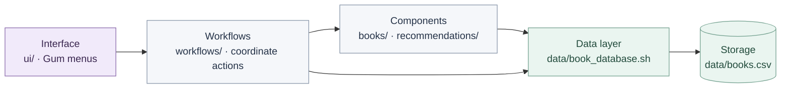
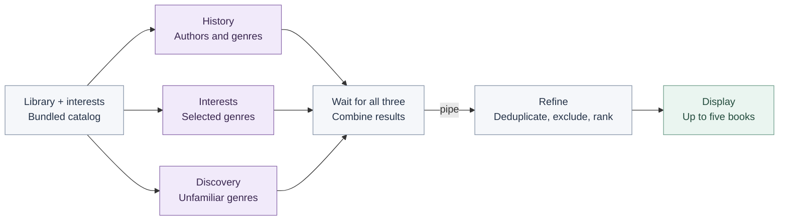

# Between the Pages

A personal terminal book manager for saving books, tracking reading status and ratings, and choosing what to read next. Built from small Bash programs for **MIT 1.125 · PS02**.

## Demo

[**Watch the narrated demo**](../HW2_DEMO_tiny.mp4) · [Download the compressed MP4](https://github.com/Ghaida486/HW2/raw/refs/heads/main/HW2_DEMO_tiny.mp4)

480p · approximately 1.5 MB · 5 minutes 15 seconds. Shows library management, recommendations, discovery, and editing interests. If playback is unavailable on GitHub, download the file to watch.

## Setup and run

Requires **Bash, Gum, and Python 3**. On macOS with Homebrew:

```bash
brew install gum python
git clone https://github.com/Ghaida486/HW2.git
cd HW2/book-manager
bash app.sh
```

Already downloaded the project? Open `book-manager/` in Terminal and run `bash app.sh`.

Use **arrow keys** and **Enter** to navigate. In **Edit Interests**, press **X** to select genres and **Enter** to save. The menu offers browsing, adding, searching, recommendations, **Surprise Me**, and editing interests. From a saved book's details, update its status or rating, or delete it after confirmation. Library changes persist between runs.

## Architecture

`app.sh` checks dependencies and opens the Gum interface in `ui/`. The screens collect input and display results; `workflows/` coordinates the requested actions. The `books/` components search saved books and look up metadata, while `recommendations/` generates and refines suggestions. All application access to `books.csv` goes through `data/book_database.sh`, whose embedded Python helper parses CSV safely. Scripts exchange tab-separated records on standard output; progress messages use standard error so they stay separate from the data.



The workflow also calls the data layer directly for simple operations such as listing, updating, and deleting books. The bundled `books/catalog.tsv` supplies metadata and recommendation candidates; `data/interests.txt` stores selected genres.

### How recommendations flow

`workflows/get_recommendations.sh` starts three independent Bash programs with `&`, captures their process IDs with `$!`, displays running/done messages and an elapsed timer while work is active, and synchronizes with `wait`. It combines their temporary output files and pipes them into `refine_recommendations.sh` using `|`. The UI displays the resulting shortlist and lets the user save a selection.



### Recommendation logic

**Get Recommendations asks: which books in the bundled catalog might I want to read next?** Three independent scripts examine the same 23-book catalog from different perspectives. They use explicit matching rules, rather than a live AI model or an online search. Library information comes through `data/book_database.sh`; selected genres come from **Edit Interests** and are saved in `data/interests.txt`.

| Strategy and script | Information it considers | Selection rule and displayed reason |
|---|---|---|
| **History** — `recommend_from_history.sh` | Authors and genres from saved books rated **3–5**, plus books left **unrated (0)**. Reading status does not affect this rule. | A matching author receives **5 points** and “Shared author with your library.” Otherwise, a matching genre receives **4 points** and “Matches a genre in your library.” Books rated 1–2 do not contribute authors or genres to this strategy. |
| **Interests** — `recommend_from_interests.sh` | Genres explicitly selected in **Edit Interests**. It does not use reading status or ratings. | An exact genre match, ignoring letter case, receives **3 points** and “Matches your interests.” For example, choosing Fantasy makes fantasy titles eligible. |
| **Discovery** — `recommend_for_discovery.sh` | Genres of **all saved books**, regardless of status or rating, together with selected interests. | A genre absent from both groups receives **2 points** and “Explore a new genre.” For example, Science is eligible if it is neither saved in the library nor selected as an interest. |

These scores are fixed priorities used by the program, not predictions of how much I will enjoy a book. An unrated saved book is treated as a possible interest signal; the app does not assume that I have finished or enjoyed it.

**How the final shortlist is selected:**

1. Combine the three scripts' results and sort candidates by score, highest first.
2. Remove books already saved in the library. Identify books by their title–author pair, ignoring letter case.
3. Merge duplicate suggestions, keeping the highest-scoring record and its explanation. Remember whether any copy also matched my selected interests.
4. Put the highest-ranked available interest match first. Fill the remaining places in score order while reserving one place for a discovery candidate when available, then fill any spare places from the remaining candidates.
5. Display **up to five books**. Selecting a recommendation lets me continue to the save action; generating the list alone does not save anything.

**Why can an interest match display a History explanation?** Suppose Fantasy is selected and an eligible saved book is also Fantasy. A new fantasy title can be suggested by both History (4 points) and Interests (3 points). Refinement keeps the History explanation because it has the higher score, but remembers the interest match and can place that book first. A shared-author match would receive 5 points instead; the scores are not added together.

**Surprise Me** launches the same three scripts but passes only Discovery's results to refinement, so its shortlist contains unfamiliar genres. With an empty library, History produces no candidates; Interests and Discovery can still contribute. Because suggestions come from a fixed catalog, fewer than five books—or none—may remain after filtering. Repeating the request with unchanged library data and interests gives the same results.

## Personalization

I built Between the Pages around my interest in fiction, mystery, and fantasy, with a purple terminal interface and a curated book catalog. Through **Edit Interests**, I can change my selected genres as my reading preferences evolve. I can track books as owned, want-to-read, reading, or finished, and record ratings. I can also select a saved book from **Browse Library** or **Search Library** and choose **Delete book** to remove it from my library after confirmation. Recommendations balance familiar authors and genres with an unfamiliar choice, while **Surprise Me** helps me explore beyond my usual selections. Included books and ratings are demonstration data, not claims about my reading history or personal reviews.

## Scope and verification

Metadata and recommendations use a **bundled 23-book catalog and deterministic rules**. No live AI or book API is called; after setup, core features work offline. Books outside the catalog can be entered manually, with unavailable metadata left as unknown. The app is intended for one user running one instance.

From `book-manager/`, run the integration checks against temporary libraries:

```bash
python3 tests/test_app.py
```

For each file's responsibility and complete input-to-output examples, see the [walkthrough](WALKTHROUGH.md). For example, adding a book follows **UI input → manage library workflow → metadata lookup → database → saved record**.

Based on the [course starter](https://github.com/onexi/ps02), with its license retained. Developed with Codex assistance.
