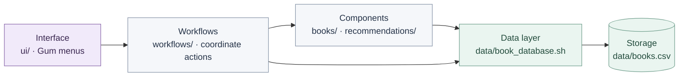
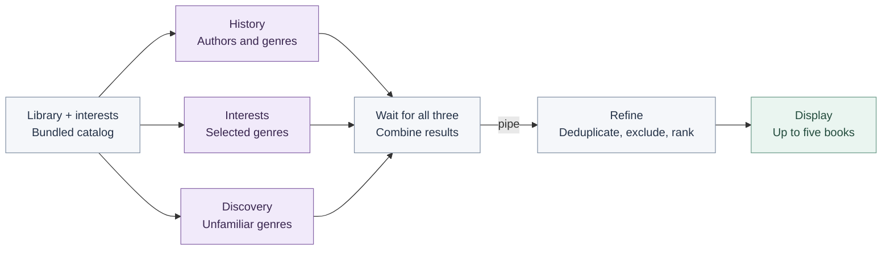

# Between the Pages

A personal terminal book manager for saving books, tracking reading status and ratings, and choosing what to read next. Built from small Bash programs for **MIT 1.125 · PS02**.

## Demo

[**Watch the narrated demo**](../HW2_DEMO_tiny.mp4) · [Download the compressed MP4](https://github.com/Ghaida486/HW2/raw/refs/heads/main/HW2_DEMO_tiny.mp4)

480p · approximately 1.5 MB · 5 minutes 15 seconds. Shows library management, recommendations, discovery, and editing interests. If playback is unavailable on GitHub, download the file to watch.

## Setup and run

Requires **Bash, Gum, and Python 3**. On macOS with Homebrew:

```bash
brew install gum python
git clone https://github.com/Ghaida486/HW2.git
cd HW2/book-manager
bash app.sh
```

Already downloaded the project? Open `book-manager/` in Terminal and run `bash app.sh`.

Use **arrow keys** and **Enter** to navigate. In **Edit Interests**, press **X** to select genres and **Enter** to save. The menu offers browsing, adding, searching, recommendations, **Surprise Me**, and editing interests. From a saved book's details, update its status or rating, or delete it after confirmation. Library changes persist between runs.

## Architecture

`app.sh` checks dependencies and opens the Gum interface in `ui/`. The screens collect input and display results; `workflows/` coordinates the requested actions. The `books/` components search saved books and look up metadata, while `recommendations/` generates and refines suggestions. All application access to `books.csv` goes through `data/book_database.sh`, whose embedded Python helper parses CSV safely. Scripts exchange tab-separated records on standard output; progress messages use standard error so they stay separate from the data.



The workflow also calls the data layer directly for simple operations such as listing, updating, and deleting books. The bundled `books/catalog.tsv` supplies metadata and recommendation candidates; `data/interests.txt` stores selected genres.

### How recommendations flow

`workflows/get_recommendations.sh` starts three independent Bash programs with `&`, captures their process IDs with `$!`, displays running/done messages and an elapsed timer while work is active, and synchronizes with `wait`. It combines their temporary output files and pipes them into `refine_recommendations.sh` using `|`. The UI displays the resulting shortlist and lets the user save a selection.



| Strategy | What it uses | How it selects candidates |
|---|---|---|
| **History** | Saved books rated 3–5 or left unrated | Matches an author (score 5), otherwise a genre (score 4). |
| **Interests** | Genres chosen in Edit Interests | Matches selected genres (score 3). |
| **Discovery** | Saved genres and selected interests | Chooses genres outside both groups (score 2). |

Refinement removes saved books and duplicate title–author pairs, keeps the strongest duplicate, and returns at most five suggestions. It puts an available interest match first and reserves a discovery slot when available. **Surprise Me** runs the same workflow but sends only discovery candidates into refinement.

## Personalization

I built Between the Pages around my interest in fiction, mystery, and fantasy, with a purple terminal interface and a curated book catalog. I can change my selected genres, track books as owned, want-to-read, reading, or finished, and record ratings. Recommendations balance familiar authors and genres with an unfamiliar choice, while **Surprise Me** helps me explore beyond my usual selections. Included books and ratings are demonstration data, not claims about my reading history or personal reviews.

## Scope and verification

Metadata and recommendations use a **bundled 23-book catalog and deterministic rules**. No live AI or book API is called; after setup, core features work offline. Books outside the catalog can be entered manually, with unavailable metadata left as unknown. The app is intended for one user running one instance.

From `book-manager/`, run the integration checks against temporary libraries:

```bash
python3 tests/test_app.py
```

For each file's responsibility and complete input-to-output examples, see the [walkthrough](WALKTHROUGH.md). For example, adding a book follows **UI input → manage library workflow → metadata lookup → database → saved record**.

Based on the [course starter](https://github.com/onexi/ps02), with its license retained. Developed with Codex assistance.
